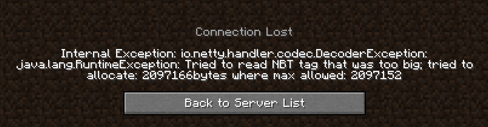
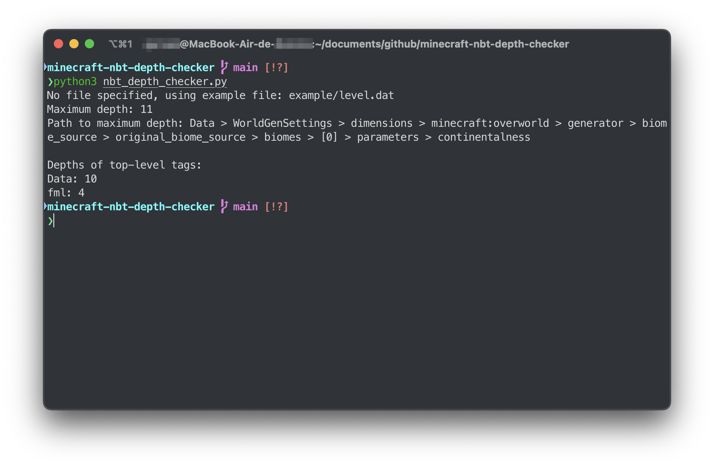

# Minecraft NBT Depth Checker

A Python utility to analyze and diagnose NBT depth issues in Minecraft save files, particularly useful when encountering the "tried to read nbt tag that was too big tried to allocate" error caused by excessive NBT tag depths.



## Overview

When Minecraft worlds become complex or corrupted, they can develop issues with NBT (Named Binary Tag) structures becoming too deep or complex. This commonly manifests as a `java.lang.RuntimeException` with a message about trying to allocate too many bytes when attempting to load the world.

This tool helps you identify which parts of your save file's `level.dat` are reaching concerning depths, allowing you to track down and fix issues before they cause crashes.

## Example Output

Here's what the tool's output looks like when analyzing a problematic level.dat file:



## Features

- Analyzes Minecraft level.dat files for NBT tag depths
- Reports maximum depth found and the full path to the deepest tags
- Identifies all top-level tags with their respective depths
- Highlights potentially problematic deep structures
- Helps diagnose "tried to allocate" errors related to NBT complexity

## Requirements

- Python 3.6 or higher
- NBT library (`NBT`)

## Installation

1. Clone this repository:

```bash
git clone https://github.com/decryptu/minecraft-nbt-depth-checker
cd minecraft-nbt-depth-checker
```

2. Install the required dependency:

```bash
pip install -r requirements.txt
```

## Usage

The script can analyze any Minecraft level.dat file. This file is typically found in your world save folder:

- Windows: `%appdata%/.minecraft/saves/[world_name]/level.dat`
- Linux: `~/.minecraft/saves/[world_name]/level.dat`
- macOS: `~/Library/Application Support/minecraft/saves/[world_name]/level.dat`

To analyze a level.dat file:

1. Run the script with your level.dat path:

```bash
python nbt_depth_checker.py path/to/your/level.dat
```

Or use the example file:

```bash
python nbt_depth_checker.py
```

or

```bash
python3 nbt_depth_checker.py
```

The script will output:

- The maximum NBT depth found in the file
- The path to the deepest structure
- Depths of all top-level tags
- Detailed paths for any tags exceeding a specified depth threshold

## Example File

The repository includes an example `level.dat` file in the `example/` directory that demonstrates the kind of issues this tool can detect. Replace it with your own level.dat file for analysis.

## Common Issues

The "tried to allocate" error typically occurs in the level.dat file of your Minecraft save. This can happen due to:

- Complex redstone contraptions
- Large numbers of entities in a small area
- Corrupted chunks
- Mod-related issues
- World conversion issues

## Contributing

Contributions are welcome! Please feel free to submit a Pull Request.

## License

This project is licensed under the MIT License - see the LICENSE file for details.

## Acknowledgments

- Thanks to [minecraft-nbt-lib](https://github.com/twoolie/NBT) for providing the NBT file parsing functionality
- Inspired by Minecraft save debugging challenges and community needs

## Technical Background

Minecraft uses NBT (Named Binary Tag) format to store various game data in the level.dat file. While the format allows for nested structures, excessive nesting can lead to memory allocation issues. The error typically occurs when trying to load a world where the NBT structure has become too complex, often manifesting as a 2MB allocation error.
